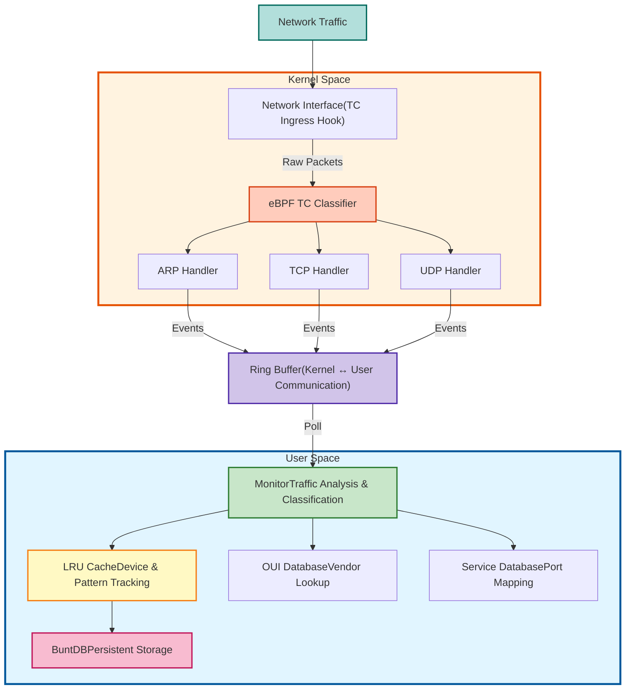

# Cerberus

**Network Guardian - Real-time Traffic Monitoring & Device Discovery**

Cerberus is a high-performance network monitoring tool built with eBPF (Extended Berkeley Packet Filter) that provides real-time visibility into network traffic, device discovery, and traffic pattern analysis.

## Features

- **Real-time Traffic Capture**: Monitor ARP, TCP, and UDP traffic at the kernel level using eBPF
- **Device Discovery**: Automatically detect new devices joining your network
- **Traffic Classification**: Identify and classify network protocols (HTTP, HTTPS, SSH, DNS, DHCP, NTP, etc.)
- **Vendor Identification**: Lookup device manufacturers using IEEE OUI database
- **Pattern Tracking**: Track unique communication patterns with LRU caching
- **Statistics Dashboard**: Real-time network statistics and device behavior analysis
- **Smart Deduplication**: Only alert on new traffic patterns (first occurrence)
- **Persistent Storage**: Local database for historical data with Redis migration path

## Architecture


## Prerequisites

- Linux kernel 4.18+ (with eBPF support)
- Go 1.24+
- Clang/LLVM
- Root/sudo privileges (for eBPF and TC hooks)

### System Requirements
```bash
# Ubuntu/Debian
sudo apt-get install -y \
    clang \
    llvm \
    libbpf-dev \
    linux-headers-$(uname -r) \
    make \
    gcc

# Verify kernel support
uname -r  # Should be 4.18+
grep CONFIG_BPF_SYSCALL /boot/config-$(uname -r)  # Should output =y
```

## Quick Start

### Installation
```bash
# Clone the repository
git clone https://github.com/zrougamed/cerberus.git
cd cerberus

# Install Go dependencies
go mod download

# Build
make

# Run
sudo ./build/cerberus
```

### Usage
```bash
# Basic usage
sudo ./build/cerberus

```

## Output Examples

### New Device Detection
```
NEW DEVICE DETECTED!
   MAC:     dc:62:79:2f:39:28
   IP:      192.168.0.108
   Vendor:  IoT Device
   First Seen: 2024-12-06 16:51:12
```

### Traffic Patterns
```
[TCP] 192.168.0.100 (aa:bb:cc:dd:ee:ff) [Apple] → 8.8.8.8:443 (HTTPS)
[UDP] 192.168.0.100 (aa:bb:cc:dd:ee:ff) [Apple] → 1.1.1.1:53 (DNS)
[TCP] 192.168.0.50 (11:22:33:44:55:66) [Raspberry Pi] → 192.168.0.200:22 (SSH)
[ARP] 0.0.0.0 (aa:bb:cc:dd:ee:ff) [Apple] → 192.168.0.100 (ARP_PROBE)
[ARP] 192.168.0.1 (6c:4f:89:7e:9c:e0) [Router/Gateway] → 192.168.0.1 (ARP_ANNOUNCE)
```

### Statistics Summary
```
╔════════════════════════════════════════════════════════════════╗
║              NETWORK STATISTICS SUMMARY                       ║
╠════════════════════════════════════════════════════════════════╣
║ Total Devices: 15                                             ║
║ Total Packets: 45821                                          ║
║   - ARP: 1245                                                 ║
║   - TCP: 38456                                                ║
║   - UDP: 6120                                                 ║
╚════════════════════════════════════════════════════════════════╝
```

## Traffic Classification

### Supported Protocols

**ARP Traffic:**
- `ARP_REQUEST` - Standard ARP requests
- `ARP_REPLY` - ARP responses
- `ARP_PROBE` - Address conflict detection (0.0.0.0 source)
- `ARP_ANNOUNCE` - Gratuitous ARP announcements
- `ARP_SCAN` - Network scanning behavior

**TCP Traffic:**
- `TCP_SYN` - Connection initiation
- `TCP_SYNACK` - Connection acknowledgment
- `TCP_ACK` - Data acknowledgment
- `TCP_FIN` - Connection termination
- `TCP_RST` - Connection reset
- `TCP_HTTP` - Port 80 traffic
- `TCP_HTTPS` - Port 443 traffic
- `TCP_SSH` - Port 22 traffic
- `TCP_CUSTOM` - Other TCP services

**UDP Traffic:**
- `UDP_DNS` - Port 53 (DNS queries)
- `UDP_DHCP` - Port 67/68 (DHCP)
- `UDP_NTP` - Port 123 (Time sync)
- `UDP_SNMP` - Port 161/162 (Network management)
- `UDP_CUSTOM` - Other UDP services

## Configuration

### Network Interface

By default, Cerberus monitors all physical network interfaces. To customize:
```go
// In cmd/cerberus/main.go
// Modify the interface selection logic to target specific interfaces
```

### Cache Size
```go
// Adjust LRU cache size (default: 1000 devices)
monitor, err := monitor.NewNetworkMonitor(1000, "network.db")
```

### Statistics Interval
```go
// Change statistics printing interval (default: 60 seconds)
statsTicker := time.NewTicker(60 * time.Second)
```

## Project Structure
```
cerberus/
├── build/              # Compiled binaries
├── cmd/
│   └── cerberus/       # Main application entry point
├── ebpf/               # eBPF C programs
│   └── arp_xdp.c       # TC classifier for packet capture
├── internal/
│   ├── cache/          # LRU cache implementation
│   ├── databases/      # OUI and service databases
│   ├── models/         # Data structures
│   ├── monitor/        # Core monitoring logic
│   ├── network/        # Network utilities
│   └── utils/          # Helper functions
├── scripts/            # Utility scripts
│   └── cleanup.sh      # TC hook cleanup
├── Makefile            # Build automation
└── go.mod              # Go dependencies
```

## Development

### Build from Source
```bash
# Build eBPF program
make bpf

# Build Go binary
make build

# Clean build artifacts
make clean
```

### Testing
```bash
sudo ./build/cerberus 
```

### Debugging
```bash
# Check TC hooks
sudo tc filter show dev enp3s0 ingress

# List loaded BPF programs
sudo bpftool prog show

# Check BPF maps
sudo bpftool map show

# View ringbuffer events
sudo bpftool map dump name events
```

## Troubleshooting

### "Operation not permitted"
```bash
# Ensure you're running with sudo
sudo ./build/cerberus
```

### "Interface not found"
```bash
# List available interfaces
ip link show

# Update interface name in code if needed
```

### "TC hook already exists"
```bash
# Clean up existing hooks
make cleanup
# Or manually:
sudo tc qdisc del dev eth0 ingress
```

### No traffic detected
```bash
# Verify interface has traffic
sudo tcpdump -i eth0 -c 10

# Generate test traffic
ping google.com
curl https://zrouga.email
```

## Security Considerations

- Requires root privileges for eBPF and TC operations
- Captures network metadata only (not packet contents)
- Local database stored at `network.db`
- No external network connections made by Cerberus itself

## Roadmap

- [ ] Redis backend for distributed deployments
- [ ] REST API for external integrations
- [ ] Web dashboard for visualization
- [ ] Anomaly detection using ML
- [ ] IPv6 support
- [ ] Packet payload inspection (optional)
- [ ] Export to Prometheus/Grafana
- [ ] Custom alerting rules
- [ ] GeoIP location tracking

## License

MIT

## Contributing

Contributions are welcome! Please feel free to submit a Pull Request.

## Contact

[Mohamed Zrouga](https://zrouga.email)

## Acknowledgments

- Built with [libbpfgo](https://github.com/aquasecurity/libbpfgo)
- Uses [BuntDB](https://github.com/tidwall/buntdb) for storage
- Inspired by network security monitoring tools

---

**Made with ❤️ and eBPF**