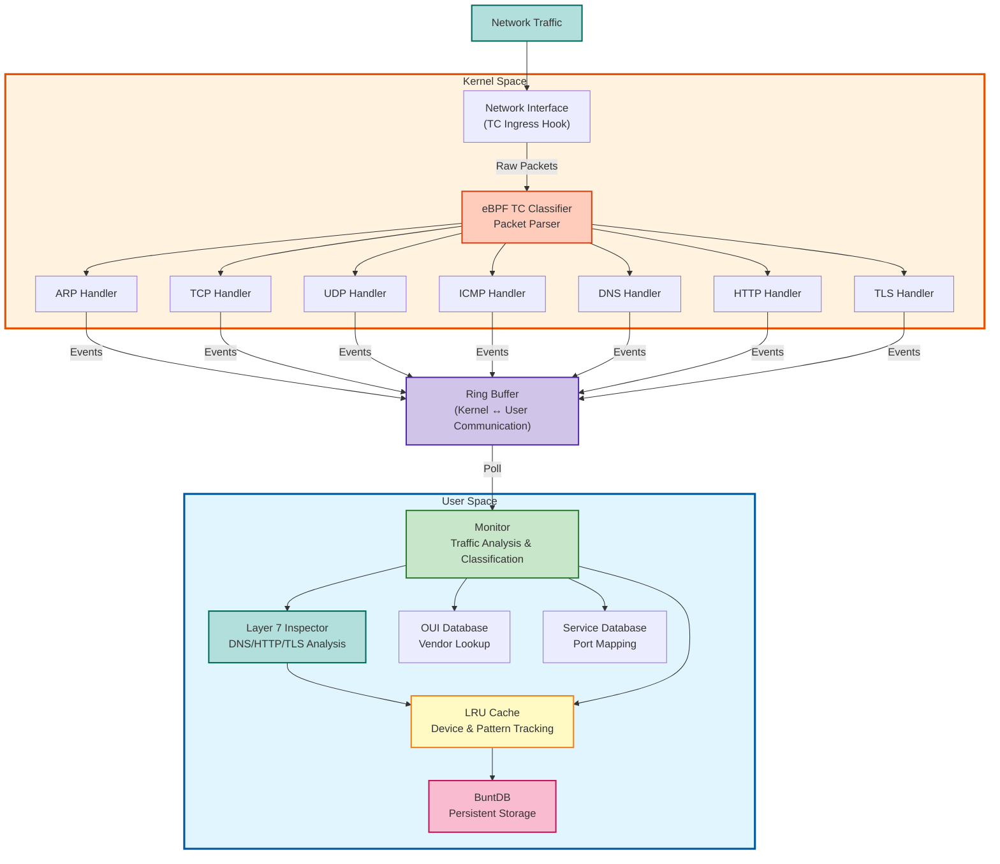

# Cerberus


**Network Guardian - Real-time Traffic Monitoring & Device Discovery**

Cerberus is a high-performance network monitoring tool built with eBPF (Extended Berkeley Packet Filter) that provides real-time visibility into network traffic, device discovery, and Layer 7 protocol analysis.

## Features

- **Real-time Traffic Capture**: Monitor ARP, TCP, UDP, ICMP, DNS, HTTP, and TLS traffic at the kernel level using eBPF
- **Layer 7 Protocol Inspection**: Deep packet inspection for DNS queries, HTTP requests, and TLS handshakes
- **Device Discovery**: Automatically detect new devices joining your network
- **Traffic Classification**: Identify and classify network protocols with intelligent pattern recognition
- **Vendor Identification**: Lookup device manufacturers using IEEE OUI database
- **Pattern Tracking**: Track unique communication patterns with LRU caching
- **Statistics Dashboard**: Real-time network statistics and device behavior analysis
- **Smart Deduplication**: Only alert on new traffic patterns (first occurrence)
- **Persistent Storage**: Local database for historical data with Redis migration path
- **REST API**: Full-featured API with Swagger documentation for integrations
- **Web Dashboard**: Modern React-based UI for real-time monitoring and visualization

## Why Cerberus?

**Built with Pure Go + eBPF** - Cerberus uses [cilium/ebpf](https://github.com/cilium/ebpf) instead of CGO-based alternatives, delivering:
- **Zero CGO dependencies** - No libbpf version conflicts, works everywhere
- **95% smaller binaries** - 19.5MB vs 447MB Docker images
- **64% faster builds** - 31s vs 87s compilation time
- **Production-proven** - Same library powering Cilium, Falco, and Tetragon

*Cerberus is portable, maintainable, and battle-tested at scale.*

## Architecture




## Prerequisites

- Linux kernel 5.10+ (with eBPF support)
- Go 1.24+
- Clang/LLVM
- Root/sudo privileges (for eBPF and TC hooks)

### System Requirements

```bash
# Ubuntu/Debian
sudo apt-get install -y \
    clang \
    llvm \
    libbpf-dev \
    linux-headers-$(uname -r) \
    make \
    gcc

# Verify kernel support
uname -r  # Should be 5.10+
grep CONFIG_BPF_SYSCALL /boot/config-$(uname -r)  # Should output =y
```

## Quick Start

### Installation

```bash
# Clone the repository
git clone https://github.com/zrougamed/cerberus.git
cd cerberus

# Install Go dependencies
go mod download

# Build
make

# Run
sudo ./build/cerberus
```

### Running with Web UI (Docker)

The easiest way to run Cerberus with the web dashboard is using Docker:

```bash
# Build everything (backend + UI)
make stack-build

# Start the full stack
make stack-up

# Access the services:
#   - Web UI:      http://localhost:3000
#   - Backend API: http://localhost:8080/api/v1
#   - Swagger:     http://localhost:8080/swagger/index.html

# View logs
make stack-logs

# Stop everything
make stack-down
```

### Usage

```bash
# Basic usage
sudo ./build/cerberus
```

## Web UI

Cerberus includes a modern web dashboard for real-time network monitoring.

### Features

- **Dashboard**: Real-time packet statistics, traffic charts, and live activity feed
- **Devices**: Browse and filter discovered network devices with detailed info
- **Device Detail**: Deep-dive into individual device traffic, DNS queries, and patterns
- **Patterns**: Live stream of network communication events with protocol filtering
- **Interfaces**: Monitor status of network interfaces being captured
- **Lookup Tools**: MAC vendor and port service lookup utilities

### Screenshots

The dashboard provides real-time visibility into:
- Protocol distribution (TCP, UDP, DNS, HTTP, TLS, ARP, ICMP)
- Active device count and traffic statistics
- Live communication pattern stream
- Network interface health

### Running the UI Standalone

```bash
# Using Docker
cd web
make build
make run PORT=3000 CERBERUS_BACKEND=http://your-cerberus-host:8080/api/v1/

# Development mode (requires Node.js 20+)
cd web
npm install
npm run dev:client
```

## Output Examples

### New Device Detection

```
NEW DEVICE DETECTED!
   MAC:     dc:62:79:2f:39:28
   IP:      192.168.0.108
   Vendor:  IoT Device
   First Seen: 2024-12-06 16:51:12
```

### Traffic Patterns

```
[TCP] 192.168.0.100 (aa:bb:cc:dd:ee:ff) [Apple] → 8.8.8.8:443 (HTTPS)
[UDP] 192.168.0.100 (aa:bb:cc:dd:ee:ff) [Apple] → 1.1.1.1:53 (DNS)
[DNS] 192.168.0.100 (aa:bb:cc:dd:ee:ff) [Apple] → 8.8.8.8:53 (DNS) [google.com]
[HTTP] 192.168.0.100 (aa:bb:cc:dd:ee:ff) [Apple] → 93.184.216.34:80 (HTTP) [GET /index.html]
[TLS] 192.168.0.100 (aa:bb:cc:dd:ee:ff) [Apple] → 142.250.185.46:443 (TLS) [TLS]
[ICMP] 192.168.0.100 (aa:bb:cc:dd:ee:ff) [Apple] → 8.8.8.8 (ICMP_ECHO_REQUEST)
[TCP] 192.168.0.50 (11:22:33:44:55:66) [Raspberry Pi] → 192.168.0.200:22 (SSH)
[ARP] 0.0.0.0 (aa:bb:cc:dd:ee:ff) [Apple] → 192.168.0.100 (ARP_PROBE)
[ARP] 192.168.0.1 (6c:4f:89:7e:9c:e0) [Router/Gateway] → 192.168.0.1 (ARP_ANNOUNCE)
```

### Statistics Summary

```
╔════════════════════════════════════════════════════════════════╗
║              NETWORK STATISTICS SUMMARY                        ║
╠════════════════════════════════════════════════════════════════╣
║ Total Devices: 15                                              ║
║ Total Packets: 45821                                           ║
║   - ARP:  1245                                                 ║
║   - TCP:  38456                                                ║
║   - UDP:  6120                                                 ║
║   - ICMP: 245                                                  ║
║   - DNS:  892                                                  ║
║   - HTTP: 156                                                  ║
║   - TLS:  1834                                                 ║
╚════════════════════════════════════════════════════════════════╝
```

### Device Statistics

```
┌─ Device: aa:bb:cc:dd:ee:ff
│  IP: 192.168.1.100 | Vendor: Apple
│  ARP: Req=5 Reply=3 | TCP: 42 | UDP: 15 | ICMP: 8
│  DNS Queries: 23 | Top Domains: google.com(5) facebook.com(3) twitter.com(2)
│  HTTP Requests: 12
│  TLS Connections: 18
│  Top Services: HTTPS(18) DNS(23) HTTP(12) ICMP_ECHO_REQUEST(8)
│  First: 14:32:15 | Last: 15:47:32
│  Recent Targets: [8.8.8.8, 142.250.185.46, 93.184.216.34]
└─
```

## Traffic Classification

### Supported Protocols

**ARP Traffic:**
- `ARP_REQUEST` - Standard ARP requests
- `ARP_REPLY` - ARP responses
- `ARP_PROBE` - Address conflict detection (0.0.0.0 source)
- `ARP_ANNOUNCE` - Gratuitous ARP announcements
- `ARP_SCAN` - Network scanning behavior

**TCP Traffic:**
- `TCP_SYN` - Connection initiation
- `TCP_SYNACK` - Connection acknowledgment
- `TCP_ACK` - Data acknowledgment
- `TCP_FIN` - Connection termination
- `TCP_RST` - Connection reset
- `TCP_HTTP` - Port 80 traffic
- `TCP_HTTPS` - Port 443 traffic
- `TCP_SSH` - Port 22 traffic
- `TCP_CUSTOM` - Other TCP services

**UDP Traffic:**
- `UDP_DNS` - Port 53 (DNS queries)
- `UDP_DHCP` - Port 67/68 (DHCP)
- `UDP_NTP` - Port 123 (Time sync)
- `UDP_SNMP` - Port 161/162 (Network management)
- `UDP_CUSTOM` - Other UDP services

**ICMP Traffic:**
- `ICMP_ECHO_REQUEST` - Ping requests (type 8)
- `ICMP_ECHO_REPLY` - Ping replies (type 0)
- `ICMP_DEST_UNREACHABLE` - Destination unreachable (type 3)
- `ICMP_TIME_EXCEEDED` - TTL exceeded (type 11)
- `ICMP_REDIRECT` - Redirect messages (type 5)
- `ICMP_CUSTOM` - Other ICMP types

**DNS Traffic:**
- `DNS_QUERY` - DNS query requests
- `DNS_RESPONSE` - DNS query responses
- Extracts queried domain names from packets

**HTTP Traffic:**
- `HTTP_GET` - HTTP GET requests
- `HTTP_POST` - HTTP POST requests
- `HTTP_REQUEST` - Other HTTP methods
- Extracts request method and path

**TLS Traffic:**
- `TLS_CLIENT_HELLO` - TLS handshake initiation
- `TLS_SERVER_HELLO` - TLS handshake response
- `TLS_HANDSHAKE` - Generic TLS handshake
- Detects encrypted connections

## Layer 7 Protocol Inspection

Cerberus performs deep packet inspection to extract application-layer information:

### DNS Inspection
- Parses DNS query names from QNAME field
- Supports label-based domain name format
- Tracks domains queried per device
- Example: `[DNS] 192.168.1.100 → 8.8.8.8:53 (DNS) [example.com]`

### HTTP Inspection
- Identifies HTTP methods (GET, POST, HEAD, PUT, DELETE)
- Extracts request paths from HTTP requests
- Tracks HTTP hosts contacted per device
- Example: `[HTTP] 192.168.1.100 → 93.184.216.34:80 (HTTP) [GET /api/v1/users]`

### TLS Inspection
- Detects TLS handshake records (0x16)
- Identifies Client Hello and Server Hello messages
- Tracks TLS connections per device
- Example: `[TLS] 192.168.1.100 → 142.250.185.46:443 (TLS) [TLS]`

### Packet Structure

The eBPF program captures 75 bytes per event:

```c
struct network_event {
    __u8 event_type;       // 1 byte  - Event type (ARP/TCP/UDP/ICMP/DNS/HTTP/TLS)
    __u8 src_mac[6];       // 6 bytes - Source MAC address
    __u8 dst_mac[6];       // 6 bytes - Destination MAC address
    __u32 src_ip;          // 4 bytes - Source IP address
    __u32 dst_ip;          // 4 bytes - Destination IP address
    __u16 src_port;        // 2 bytes - Source port
    __u16 dst_port;        // 2 bytes - Destination port
    __u8 protocol;         // 1 byte  - IP protocol number
    __u8 tcp_flags;        // 1 byte  - TCP flags
    __u16 arp_op;          // 2 bytes - ARP operation code
    __u8 arp_sha[6];       // 6 bytes - ARP source hardware address
    __u8 arp_tha[6];       // 6 bytes - ARP target hardware address
    __u8 icmp_type;        // 1 byte  - ICMP message type
    __u8 icmp_code;        // 1 byte  - ICMP code
    __u8 l7_payload[32];   // 32 bytes - Layer 7 payload for inspection
} __attribute__((packed));
// Total: 75 bytes
```

## Configuration

### Network Interface

By default, Cerberus monitors all physical network interfaces. To customize:

```go
// In main.go
// Modify the interface selection logic to target specific interfaces
```

### Cache Size

```go
// Adjust LRU cache size (default: 1000 devices)
monitor, err := monitor.NewNetworkMonitor(1000, "network.db")
```

### Statistics Interval

```go
// Change statistics printing interval (default: 60 seconds)
statsTicker := time.NewTicker(60 * time.Second)
```

## Project Structure

```
cerberus/
├── .ci/                # CI/CD tests for compatibility
├── api/                # OpenAPI specification
│   └── openapi.yaml    # API schema definition
├── build/              # Compiled binaries
├── cmd/
│   └── cerberus/       # Main application entry point
├── docs/               # Generated Swagger documentation
├── ebpf/               # eBPF C programs
│   └── cerberus_tc.c   # TC classifier for packet capture
├── internal/
│   ├── api/            # REST API server (Fiber)
│   ├── cache/          # LRU cache implementation
│   ├── databases/      # OUI and service databases
│   ├── models/         # Data structures
│   ├── monitor/        # Core monitoring logic
│   ├── network/        # Network utilities
│   └── utils/          # Helper functions (includes L7 inspection)
├── scripts/            # Utility scripts
│   └── cleanup.sh      # TC hook cleanup
├── web/                # Web UI (React + TypeScript)
│   ├── client/         # Frontend source code
│   │   └── src/
│   │       ├── components/  # React components
│   │       ├── pages/       # Route pages
│   │       ├── hooks/       # Custom React hooks
│   │       ├── lib/         # API client & utilities
│   │       └── types/       # TypeScript interfaces
│   ├── Dockerfile      # UI container build
│   ├── nginx.conf      # Production server config
│   └── Makefile        # UI build targets
├── docker-compose.yml      # Backend-only compose
├── docker-compose.full.yml # Full stack (backend + UI)
├── Makefile            # Build automation
└── go.mod              # Go dependencies
```

## Development

### Build from Source

```bash
# Build eBPF program
make bpf

# Build Go binary
make build

# Clean build artifacts
make clean
```

### Testing

```bash
sudo ./build/cerberus
```

### Testing Layer 7 Inspection

```bash
# Test DNS traffic
nslookup google.com
dig example.com

# Test HTTP traffic
curl http://example.com

# Test TLS traffic
curl https://google.com

# Test ICMP traffic
ping 8.8.8.8
```

### Debugging

```bash
# Check TC hooks
sudo tc filter show dev enp3s0 ingress

# List loaded BPF programs
sudo bpftool prog show

# Check BPF maps
sudo bpftool map show

# View ringbuffer events
sudo bpftool map dump name events
```

## Troubleshooting

### "Operation not permitted"

```bash
# Ensure you're running with sudo
sudo ./build/cerberus
```

### "Interface not found"

```bash
# List available interfaces
ip link show

# Update interface name in code if needed
```

### "TC hook already exists"

```bash
# Clean up existing hooks
make cleanup
# Or manually:
sudo tc qdisc del dev eth0 ingress
```

### No traffic detected

```bash
# Verify interface has traffic
sudo tcpdump -i eth0 -c 10

# Generate test traffic
ping google.com
curl https://zrouga.email
```

### Short packet warnings

```bash
# If you see "Short packet: X bytes (expected 75)"
# This indicates a mismatch between eBPF and Go code
# Ensure both are using the same structure size (75 bytes)
```

## Security Considerations

- Requires root privileges for eBPF and TC operations
- Captures network metadata and first 32 bytes of payload for L7 inspection
- Does NOT capture or store complete packet payloads
- Local database stored at `network.db`
- No external network connections made by Cerberus itself
- L7 inspection is limited to protocol identification and metadata extraction

## Known Limitations

1. **TLS SNI Extraction**: Full SNI parsing requires more than 32 bytes of payload. Current implementation detects TLS presence.
2. **HTTP Host Header**: Current implementation extracts method and path, not the Host header.
3. **DNS Response Parsing**: Currently only extracts domain from queries, not from responses.
4. **Encrypted Traffic**: Cannot inspect encrypted payloads (TLS/HTTPS content).

## Roadmap

- [x] REST API for external integrations
- [x] Web dashboard for visualization
- [ ] Redis backend for distributed deployments
- [ ] Anomaly detection using ML
- [ ] IPv6 support
- [ ] Expand L7 payload capture to 128-256 bytes for better SNI/HTTP header extraction
- [ ] Add proper DNS response parsing
- [ ] Add HTTP Host header extraction
- [ ] Implement TLS version detection
- [ ] Support for identifying encrypted DNS (DoH/DoT)
- [ ] Track DNS response codes and query types
- [ ] Correlate DNS queries with subsequent connections
- [ ] Export to Prometheus/Grafana
- [ ] Custom alerting rules
- [ ] GeoIP location tracking
- [ ] Dark/light theme toggle in UI
- [ ] Device grouping and tagging
- [ ] Historical traffic playback

## Performance

- **Zero-copy packet processing** using eBPF ring buffers
- **LRU caching** for efficient device tracking
- **Batch database writes** every 30 seconds
- **Minimal CPU overhead** with kernel-level filtering
- **Memory efficient** with configurable cache sizes

## Compatibility

- **Go Version**: 1.24+
- **Kernel**: 5.10+ with eBPF support
- **Dependencies**: No external runtime dependencies
- **Database**: Backward compatible with existing network.db files

## License

MIT License - see LICENSE file for details

## Contributing

Contributions are welcome! Please feel free to submit a Pull Request.

1. Fork the repository
2. Create your feature branch (`git checkout -b feature/amazing-feature`)
3. Commit your changes (`git commit -m 'Add some amazing feature'`)
4. Push to the branch (`git push origin feature/amazing-feature`)
5. Open a Pull Request

## Contact

[Mohamed Zrouga](https://zrouga.email)

## Acknowledgments

- Built with [Cilium eBPF](https://github.com/cilium/ebpf)
- Uses [BuntDB](https://github.com/tidwall/buntdb) for storage
- Uses [golang-lru](https://github.com/hashicorp/golang-lru) for caching
- Inspired by network security monitoring tools

## Supported Distributions

Cerberus has been successfully built and tested on the following Linux distributions:

| Distribution | Status |
|--------------|--------|
| Ubuntu 22.04 | Passed |
| Ubuntu 24.04 | Passed |
| Debian 12    | Passed |
| Arch Linux   | Passed |

--- 

**Made with ❤️ and eBPF**
